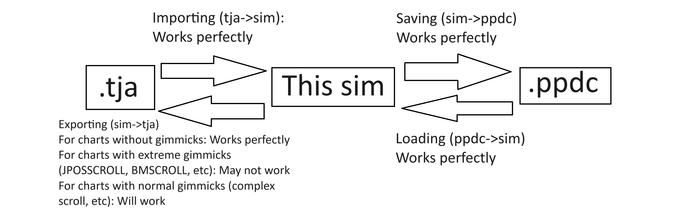

# Taiko

Popular taiko game simulator, focusing on gimmicks and a gimmick editor.

- [Taiko](#taiko)
  - [For developers](#for-developers)
  - [How to use](#how-to-use)
    - [How to use: Config](#how-to-use-config)
    - [How to use: Editor](#how-to-use-editor)
    - [Other misc shortcuts](#other-misc-shortcuts)
    - [How to save and load edited charts and clarifications](#how-to-save-and-load-edited-charts-and-clarifications)
  - [Before using (Credit: OpenTaiko)](#before-using-credit-opentaiko)
  - [License](#license)
  - [Posting Vidoes (Credit: OpenTaiko)](#posting-vidoes-credit-opentaiko)
  - [How does this work](#how-does-this-work)
  - [WARNING: Code Quality](#warning-code-quality)
  - [Using this](#using-this)
  - [Efficiency](#efficiency)
  - [Benchmarks (ParseTJA)](#benchmarks-parsetja)
  - [TODO](#todo)
  - [Credits](#credits)

## For developers
- `raylib_s.exe` is the graphics library, and it is a compiled binary from [raylib-lua](https://github.com/TSnake41/raylib-lua); feel free to compile it yourself if you want.
- `tinyfiledialogs64.dll` facilitates file dialogs such as selecting a file or folder location (calls windows explorer if on windows, etc). It is a compiled dll from [tinyfiledialogs](https://sourceforge.net/projects/tinyfiledialogs/files/), and open source.
- `Taikov34.lua` is the entire simulator. Inside it, you will find `Taiko.ParseTJA` and `Taiko.Game`
- `run.cmd` is a simple script to use `raylib_s.exe` to run `Taikov34.lua`.
- `config.tpd` is the config file. Currently, there is no GUI, but it is a JSON-like format. See [How to use: Config](#how-to-use-config).
- Copy a skin (Any OpenTaiko skin should work) into `Versions/` and name it `Assets`
- Put your tja's and songs into `Songs/`
- VERY INCOMPLETE documentation of all the functions in [docs.md](docs/docs.md)
  - Just get started there, find the function you need, and CTRL+F and find it in the source code, `Taikov34.lua`

## How to use

- On GitHub, click "Code" (Green button on the top right) and then "Download ZIP"
- Unzip the zip file you downloaded
- Click [run.cmd](Versions/run.cmd)
- Enjoy!

### How to use: Config

- Currently the config does not have a GUI
- To edit the config, go into config.tpd (use a simple text editor)
- The tpd format is very close to JSON, and you should be able to get the syntax by looking through
- A comma is always required at the end of any key value pair
- When setting a keybind, the syntax is `KEYCODEHERE = true,`
  - Find the keycodes from [raylib_keys.md](readme/raylib_keys.md)

### How to use: Editor

- The editor is one of the main useful features of this program
- It should be enabled by default
- Default controls:
  - Toggle editor overlay: Right CTRL
  - Shortcuts:
    - Select all: CTRL + a
    - Copy: CTRL + c
    - Paste: CTRL + v
    - Cut: CTRL + x
    - Delete: delete, backspace
    - "Snap" note to mouse position: CTRL + p
    - Clear all / (new note but not implemented yet): CTRL + n
    - Saving and loading:
        - Import (tja): CTRL + i
        - Export (tja): CTRL + e
        - Load (ppdc): CTRL + l
        - Save (ppdc): CTRL + s
  - Modify selection: left shift and click to select / deselect notes
  - Toggle drag mode (switch between changing note time vs note scroll): t
  - Toggle grid: g
  - Movement (freecam like mode):
    - Speed up (hold and move to move fast): left shift
    - Left: j or left arrow
    - Right: l or right arrow
    - Up: i or up arrow
    - Down: k or down arrow
    - Toggle movement: m
    - Reset movement: right shift
  - Debug mode (always enabled alongside editor):
    - Toggle auto: a
    - Retry (reloads the tja file from disk): r
    - Backward: left arrow
    - Forward: right arrow
    - Savestates (each fn key corresponds to a different savestate slot):
      - Save: left shift + (f2 - f10)
      - Load: (f2 - f10)
    - Speed up gameplay: up arrow
    - Slow down gameplay: down arrow
    - Stop time without pausing (so you can use editor): space

### Other misc shortcuts
- Default controls:
  - Toggle fullscreen: f

### How to save and load edited charts and clarifications
- .ppdc (Persistent Parsed Data Compressed) is the internal file format used by this sim, don't worry too much about it since its simply for perfectly saving the current state of the chart.
- .tja is the external file format used by this sim. This sim was initially built to only load .tja, and then .ppdc was implemented, and then exporting .tja was implemented
- For standard charts (no gimmicks): Saving and loading .ppdc and exporting and importing .tja will be perfect
- For charts with extreme gimmicks (jposscroll, bmscroll, etc (simple complex scroll is fine)): Saving and loading .ppdc, and importing .tja will be perfect, but data may be lost when exporting .tja

Chart of all formats and their relations


## Before using (Credit: OpenTaiko)

- It is **YOUR RESPONSIBILITY** to use this software. I will not take responsibilities for any problems you got from using this software.
- There will be ALMOST NO SUPPORT for this software (I am very very busy).

## License

All parts of this software written by me are licensed under the [MIT license](./LICENSE). The parts not written by me are licensed under their respective authors.

## Posting Vidoes (Credit: OpenTaiko)

- Please distinguish this simulator from the official game, and follow your country's copyright laws.

## How does this work

Simply put: This simulator uses raylib to implement the rendering and input. It parses .tja files, which are files that can store various / complicated charts.

## WARNING: Code Quality

The code for `Taiko.ParseTJA` is pretty clean and well documented, and it has descriptions of every tja command from taiko-web tja-format wiki.  
On the other hand, the code for `Taiko.PlaySong` is optimized and not documented at all. It is filled with commented out code and uses some dirty optimizations.

## Using this

If you want to parse tja files efficiently and get a table of metadata and notes, use `Taiko.ParseTJA`.  
If you want to play the parsed tja data, use `Taiko.PlaySong`.

## Efficiency

## Benchmarks (ParseTJA)

Using:  
```
Default raylib-luajit binding
CompactTJA to decompress files before the test
The ENTIRE ESE Project (Might be outdated)
```
Specs:
```
Processor	Intel(R) Core(TM) i7-6600U CPU @ 2.60GHz   2.81 GHz
Installed RAM	20.0 GB (19.9 GB usable)
System type	64-bit operating system, x64-based processor
```
Output:
```
1
Total Time (s):         21.893
Shortest Time (ms):     0    
Longest Time (ms):      72   
Total Time Parsing (ms):   18417
Average Time (ms):      8.3071718538566
Total Successes (n):    2217  
Total Errors (n):       238

2
Total Time (s):         21.976
Shortest Time (ms):     0    
Longest Time (ms):      75   
Total Time Parsing (ms):   18529
Average Time (ms):      8.3576905728462
Total Successes (n):    2217 
Total Errors (n):       238

3
Total Time (s):         20.253
Shortest Time (ms):     0
Longest Time (ms):      59   
Total Time Parsing (ms):   16816
Average Time (ms):      7.5850248082995
Total Successes (n):    2217 
Total Errors (n):       238
```

Code:
```lua
--[[
    ParseTJA Testing
    Make sure to change ParseTJA to return ms time
]]
local file = './CompactTJA/ESE/ESE.tjac' --ALL ESE

local t, header = Compact.Decompress(Compact.Read(file))

local errorn = 0
local successn = 0
local times = {}
local t1 = os.clock()
for i = 1, #t do
    print(i)
    local status, out = pcall(Taiko.ParseTJA, t[i]) --out will be ms for our test
    if status then
        times[#times + 1] = out
        successn = successn + 1
    else
        errorn = errorn + 1
    end
end

print('Total Time (s): ', os.clock() - t1)

table.sort(times)
print('Shortest Time (ms): ', times[1])
print('Longest Time (ms): ', times[#times])
local total = 0
for i = 1, #times do
    total = total + times[i]
end
print('Total Time Parsing (ms): ', total)
print('Average Time (ms): ', total / #times)


print('Total Successes (n): ', successn)
print('Total Errors (n): ', errorn)
```

## TODO


## Credits

[raylib-lua](https://github.com/TSnake41/raylib-lua)
    For their raylib binding  
[tinyfiledialogs](https://sourceforge.net/projects/tinyfiledialogs/files/)
    For their file dialogs (save, load, etc)
[OpenTaiko](https://github.com/0auBSQ/OpenTaiko)
    For their skin and code  
[Taiko-Web](https://github.com/bui/taiko-web)
    For documentation and code, and getting me started